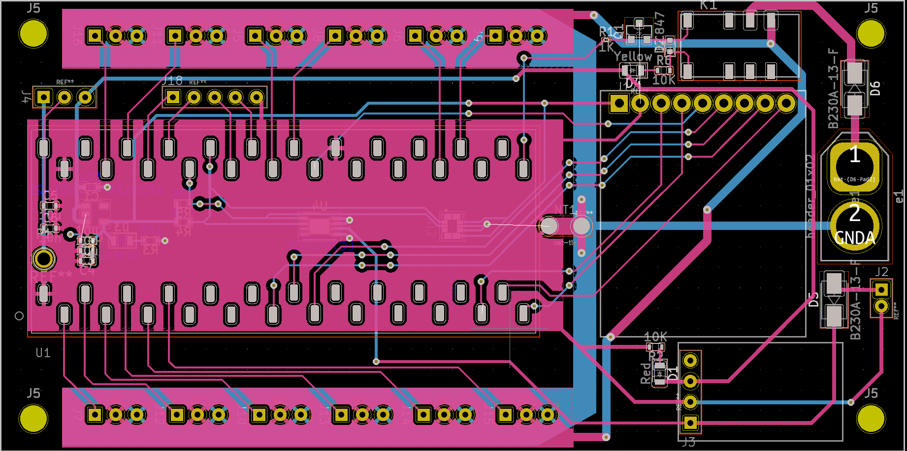

# QuadrupedHardware

A repo that contains hardware files for my quadruped project, including CAD and gerber files. 

## Quadruped Control Board V1.0

It's done! Note that I haven't had the chance to test it yet (the board hasn't arrived) and a BOM will be coming shortly.

#### Features:
- 2 layer board
- Includes 12 breakouts for all servos
- On-board IMU data (via an [LSM6DSOX](https://www.st.com/resource/en/datasheet/lsm6dsox.pdf))
- Battery capacity monitoring (via an [LC709203F](https://www.onsemi.com/pdf/datasheet/lc709203f-d.pdf))
- LoRA radio 
- Motor power shutoff capability
- Controlled by a Teensy 4.1
- Battery power/USB power selection for Teensy
- 6 breakout GPIO, including an I2C bus and associated power/ground lines
