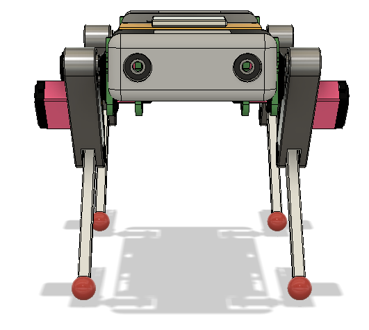

<h1 align="center">
   
  
   
  Quadruped Project
   
</h1>

 
	A quest to make a simple and affordable, yet advanced, quadruped robot.
	 
	 
	
	
	

### Software Setup
This project is compiled and uploaded to a teensy 4.1 via [PlatformIO](https://platformio.org), an extension to VS code.
Once you download <code>Code/Teensy41Main</code>, you should be able to open the folder by selecting <code>platformio.ini</code>.
Assuming you have all dependent libraries installed, you should be able to run the code!

### Library dependencies
To run this code, you'll need to install a few libraries for Arduino/Teensy.
- [QuadrupedKinematics](https://github.com/seanboe/QuadrupedKinematics)
	- [Servo](https://www.arduino.cc/reference/en/libraries/servo/)
	- [RAMP](https://github.com/siteswapjuggler/RAMP)
- [Radiohead](https://github.com/adafruit/RadioHead)

<i>Note that QuadrupedKinematics is a custom library; you will need to download it and place in the <code>lib</code>
in your platformIO project folder (which you can download above)</i>

### Hardware
You can find the CAD files in .step format [here](https://github.com/seanboe/QuadrupedProject) -will update _*very soon*_

A bill of materials (BOM) can be found [here](https://github.com/seanboe/QuadrupedProject/tree/master/Hardware) as a .numbers file or
[here](https://docs.google.com/spreadsheets/d/18XhNiGI3mZoEecLmq4_vx1SQUpdlzQzPsUQPOoMVXBk/edit#gid=0) as a google spreadsheet.

This doesn't include components for the PCB yet (I'm designing a new one)

I've also designed a PCB for this robot:  

 
Gerber files for version 1.0 can be found <a href="Hardware">here</a>.

I'm also recording most of the progress for the project on my blog, which is [here](https://seanboe.github.io/blog/),
and I release short updates on my [YouTube Channel](https://www.youtube.com/channel/UCSMmECMAWD-FGQWWuThr7_w)

### License

<a href="LICENSE">MIT</a>

### Other
Please note that most of the development for this project is done in the [QuadrupedKinematics](https://github.com/seanboe/QuadrupedKinematics)
repository. This is where most of the control processes and math is stored. 
